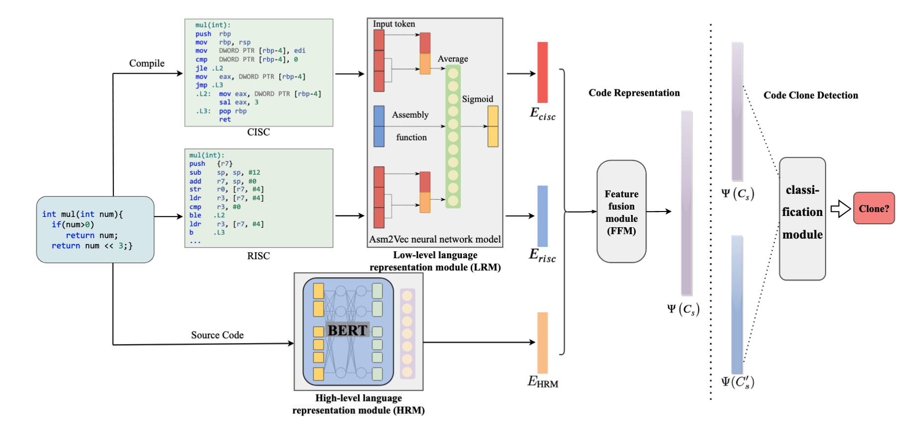

#  Prism: Decomposing Program Semantics for Code Clone Detection through Compilation (2024 ICSE)
### This is the Official implementation of our ICSE2024 paper "Prism: Decomposing Program Semantics for Code Clone Detection through Compilation".



# Quick Start

## Environment Setup
```bash
conda create -n prism Python=3.10;
conda activate prism;

# setup asm2vec
# use the packaged asm2vec snapshot or an upstream source archive when rebuilding;
export PYTHONPATH="path/to/asm2vec:$PYTHONPATH";
source ~/.bashrc;
```

## Usage

### Data Pre-processing 

__Remove comment__

__Use Gcc/G++ compiler turn C/Cpp codes to asm__

### Use Asm2Vec turn asm to vectors

```
cd asm2vec/examples
python3 1-Asm2Funcs.py
python3 2-TrainAsm.py
python3 3-FunctionAvg.py
```

### Bert Fine tune
```
python3 preRun.py
cd bert-fine-tune
./run.sh
python3 get_bert_emb_96_ft.py #get the embedding after fine tune
```

### Generate Training Data
```
cd generateTrainingData
python3 generateTrainingData.py
```

### Feature Fusion and Train DNN
```
cd dnn
python3 train_loop.py
```

### Reference
1. [FCDetector](https://github.com/shiyy123/FCDetector)
   
2.[asm2vec](https://github.com/Lancern/asm2vec)
